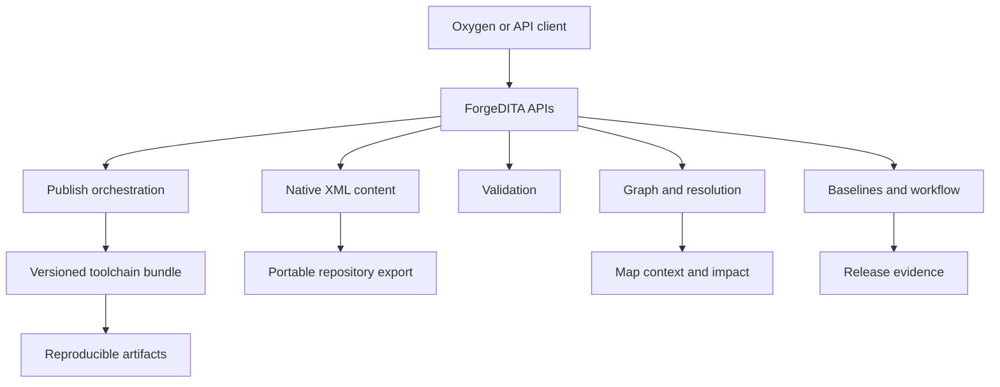

# ForgeDITA Public

Standards-first DITA infrastructure designed to remain understandable and maintainable as complexity grows.

[Website](https://forgedita.com) | [Architecture](docs/architecture/architecture-overview.md) | [Conformance](docs/conformance/public-conformance-statement.md) | [Current status](STATUS.md) | [Contact](mailto:hello@forgedita.com)

## What ForgeDITA Is

ForgeDITA is an architecture-first DITA CCMS in active development. It is built around a direct premise:

> Documentation infrastructure should remain understandable, reproducible, and portable over time.

The design emphasizes:

- native DITA XML as the system of record
- explicit, versioned processing semantics
- graph-aware validation and impact analysis
- tenant-scoped, immutable publishing toolchains
- editor independence through open APIs
- public, bounded conformance claims

This repository contains the public architecture, contracts, examples, and conformance material behind those commitments. It is not the private product source repository.

## Current Status

ForgeDITA is in active beta. The MVP, release-candidate, core API, client-facing web UI, deployable-stack, and conformance-publication gates have been completed. Current work is focused on production Oxygen acceptance, deeper DITA interoperability, beta hardening, and closing documented edge cases. The repository distinguishes among:

- **Claimed:** backed by current implementation evidence
- **Beta:** implemented and under active evaluation or hardening
- **Planned:** architectural direction, not current capability
- **Not claimed:** explicitly outside the current conformance boundary

See [STATUS.md](STATUS.md) before treating any architecture document as a product claim.

## Architectural Model

## Explore the Repository

### Product and architecture

- [Product principles](docs/product-principles.md)
- [Architecture overview](docs/architecture/architecture-overview.md)
- [Architecture brief](docs/architecture/architecture-brief.md)
- [Reference architecture](docs/architecture/reference-architecture.md)
- [Multi-tenant toolchain registry](docs/architecture/multi-tenant-toolchain-registry.md)
- [Extensibility architecture](docs/architecture/extensibility-architecture.md)
- [Security architecture](docs/architecture/security-architecture.md)
- [Editor authoring contract](docs/editor-authoring-contract.md)

### Conformance and evidence

- [Public conformance statement](docs/conformance/public-conformance-statement.md)
- [Conformance matrix](docs/conformance/conformance-matrix.md)
- [Evidence model](docs/conformance/evidence-index.md)
- [Illustrative evidence record](examples/conformance-evidence/example-evidence.json)

### Publishing

- [Reproducible publishing](docs/publishing/reproducible-publishing.md)
- [Toolchain bundles](docs/publishing/toolchain-bundles.md)
- [Runtime manifests](docs/publishing/runtime-manifests.md)

### Content model

- [Native XML storage](docs/content-model/native-xml-storage.md)
- [Graph and resolution](docs/content-model/graph-and-resolution.md)
- [Semantic registry](docs/content-model/semantic-registry.md)

### Integration

- [API overview](docs/integration/api-overview.md)
- [Capability discovery](docs/integration/capability-discovery.md)
- [Events and webhooks](docs/integration/webhooks.md)

### Examples

- [Sample DITA project](examples/sample-dita-project/README.md)
- [Toolchain bundle manifest](examples/toolchain-bundle-manifest/toolchain-bundle.yaml)
- [Runtime manifest](examples/runtime-manifest/runtime-manifest.json)

## What ForgeDITA Does Not Claim

ForgeDITA does not claim complete DITA 1.3 support merely because representative examples work. It does not currently claim DITA 2.0 support, independently certified production isolation, complete specialization interactions, or complete context-sensitive reference resolution.

The authoritative boundary is the [public conformance statement](docs/conformance/public-conformance-statement.md).

## Feedback

Experienced DITA practitioners are invited to challenge the model:

- Which assumptions fail in real environments?
- Where does explicit governance become excessive?
- Which interoperability cases deserve fixtures?
- Which operational failure modes remain unaddressed?

Send feedback to [hello@forgedita.com](mailto:hello@forgedita.com).

Copyright 2026 ForgeDITA.
