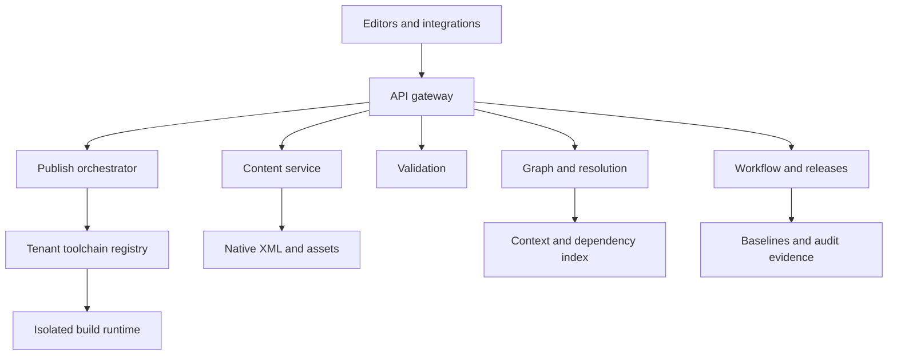

# Architecture Overview

ForgeDITA separates content, semantics, relationships, validation, workflow, and publishing into explicit service contracts.

## System View

## Content Service

Stores topics, maps, subject schemes, DITAVAL files, catalogs, grammars, and binary assets without converting DITA into a proprietary document model.

## Graph and Resolution

Extracts declared relationships and evaluates context-sensitive behavior such as key lookup and content reuse. Resolution results belong to a map context and content state, not to a global cache of guesses.

## Validation

Coordinates XML, grammar, Schematron, DITA-aware, and tenant-policy checks. Results identify location, severity, rule source, and completion state.

## Baselines and Releases

Pins exact content revisions and associates them with workflow evidence, toolchain state, and published artifacts.

## Toolchain Registry

Stores immutable tenant-owned bundles containing DITA-OT, plugins, catalogs, grammar shells, validation assets, themes, and publish profiles.

## Publish Orchestration

Combines a baseline, toolchain bundle, and publish profile into an attributable job with logs, diagnostics, artifacts, and a runtime manifest.

## Authoring Clients

Oxygen and other clients consume the same server-authoritative operations for browse, checkout, save, validation, search, impact analysis, workflow, preview, and publish.

## Status Boundary

This document summarizes target architecture. See [Product Status](../../STATUS.md) and the [Public Conformance Statement](../conformance/public-conformance-statement.md) for current claims.
