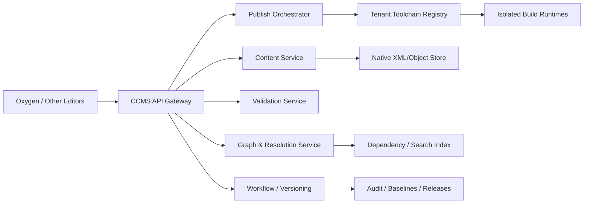

# Reference Architecture

> **Document status:** Target architecture. Current product claims are limited to the [Public Conformance Statement](../conformance/public-conformance-statement.md).

A compliance-first DITA CCMS should make one narrow promise:

- Full, specialization-aware support for **DITA 1.3** end to end today
- A separate, clearly labeled **DITA 2.0 preview lane** until the spec and toolchain reach final parity



- `Content service`
  Stores native DITA topics, maps, ditaval files, subject schemes, grammars, catalogs, and binary assets unchanged. No proprietary canonical model.

- `Versioning and baseline service`
  Handles revisions, major/minor versioning, baselines, releases, compare, audit, retention.

- `Graph and resolution service`
  Tracks `conref`, `conkeyref`, `keyref`, `xref`, map hierarchies, branch filtering, subject scheme bindings, reuse dependencies, and impact analysis.

- `Validation service`
  Runs XML well-formedness, RNG/XSD/DTD, Schematron, DITAVAL/profile checks, specialization checks, and tenant policy checks.

- `Toolchain registry`
  Stores tenant-scoped publishing bundles:
  DITA-OT version, plug-ins, catalogs, shells, constraint modules, validation assets, themes, and publishing profiles.

- `Publish orchestrator`
  Executes preview and publish in isolated containers or microVMs using immutable toolchain bundles. No shared mutable DITA-OT install.

- `Workflow and permissions`
  Check-out/check-in, locking, approvals, assignment, status transitions, release gates.

- `Search/index`
  Full-text plus DITA-aware search on IDs, keys, metadata, taxonomy, and reference graph.

**Runtime Determinism And Reliability**

ForgeDITA must be operationally predictable. Timeout wobble is treated as an architecture defect, not normal test noise.

Rules:

1. Timeout increases are not fixes unless paired with timing evidence and a remediation item.
2. Every expensive service path must expose phase-level timing as the implementation matures: request, route, database, object-store, DITA-OT, graph, queue, worker, runtime, and total duration.
3. Latency budgets must be explicit for readiness, health, metadata reads, content reads, graph work, validation, import, preview, and publish.
4. Heavyweight work must move behind job/status boundaries when it cannot meet short interactive budgets.
5. Readiness must be separate from deep dependency health.
6. Postgres, object storage, DITA-OT, queue, and runtime isolation must each have visible health and timing surfaces.
7. Fast regression, Postgres smoke, live external-runtime, object-store, and conformance-depth suites must be tiered so one slow integration class does not destabilize all evidence.
8. The current PowerShell implementation must not become architectural lock-in. Stable API, graph, validation, and runtime contracts should remain portable to Python or another production runtime when evidence shows the current runtime is the bottleneck.

**Non-Negotiable APIs**

These are the platform surface area. Everything, including Oxygen, should sit on them.

- `Repository API`
  Open, create, update, move, copy, delete, version, lock, unlock, check-in, check-out, list children, fetch metadata.

- `Content API`
  Get raw XML, save raw XML, save binaries, create from template, resolve map context, retrieve renditions.

- `Graph API`
  Resolve keys, conrefs, reuse graph, inbound/outbound references, impacted topics, map context, branch/profile view.

- `Validation API`
  Validate document, validate map, validate baseline, return structured diagnostics with exact locations and severity.

- `Preview API`
  Generate tenant-aware preview for a topic or map in a given context and profile.

- `Publish API`
  Submit job, poll job, cancel job, list profiles, retrieve outputs, retrieve logs, reproduce from baseline.

- `Baseline/Release API`
  Create immutable baseline, diff baselines, promote baseline to release, rebuild release.

- `Workflow API`
  Submit for review, approve/reject, assign, comment, transition status.

- `Package Registry API`
  Upload toolchain bundle, list versions, promote bundle, deprecate bundle, diff manifests.

- `Events/Webhooks`
  `document.changed`, `baseline.created`, `publish.completed`, `workflow.transitioned`, `toolchain.promoted`.

- `Auth API`
  OIDC/OAuth2, scoped tokens, service accounts, tenant/workspace RBAC.

**Packaging Model**

This is the heart of multitenancy.

Each tenant gets a versioned, immutable `toolchain bundle`:

- `DITA-OT version`
- `Plug-ins`
- `XML catalogs`
- `DITA shells / specializations / constraint modules`
- `RNG/XSD/DTD`
- `Schematron`
- `DITAVAL presets`
- `PDF/HTML themes`
- `Publishing profiles`

Minimal manifest shape:

```yaml
apiVersion: ccms.dita/v1
kind: ToolchainBundle
metadata:
  tenant: acme-medical
  name: acme-core
  version: 2026.04.1
spec:
  ditaSpec: 1.3
  ditaOt: 4.4
  plugins:
    - id: org.acme.medical.pdf
      version: 3.2.0
  catalogs:
    - catalog.xml
  grammars:
    - rng/acme-task.rng
  validation:
    - schematron/acme-rules.sch
  profiles:
    - name: html5-default
    - name: pdf-regulated
```

Rules:

- Bundles are immutable after promotion
- Preview/publish always names the exact bundle version
- Older releases remain rebuildable forever
- Tenant A can never affect Tenant B's toolchain
- Shared bundles are allowed only by explicit inheritance, never by shared mutable install

**Conformance Test Strategy**

Publish a public conformance matrix and make it part of CI.

1. `Spec conformance suite`
   Cover all DITA 1.3 base, technical-content, and all-inclusive features your product claims.

2. `Specialization-awareness suite`
   Verify processing by `@class` and `@domains`, not hard-coded tag names.

3. `Round-trip suite`
   Open, edit, save, export, re-import, and confirm byte-stable or semantically identical XML without proprietary pollution.

4. `Processor suite`
   Validate key processing, conref/conkeyref, map resolution, branch filtering, subject schemes, ditaval behavior, chunking, bookmap, glossary, learning/training if claimed.

5. `Packaging isolation suite`
   Same content, different tenant bundles, different outputs; no cross-tenant leakage.

6. `Reproducibility suite`
   Same baseline + same bundle = same output or intentionally versioned deterministic delta.

7. `Negative suite`
   Invalid shells, broken catalogs, invalid keys, circular conrefs, bad ditaval, unsupported bundle dependencies.

8. `Interoperability suite`
   Content authored in Oxygen and another XML editor must still validate and publish identically through the CCMS.

9. `Claim verification`
   Generate the product's conformance statement automatically from the tested feature matrix.

Important product rule:
- Never claim "100% DITA compliant" in marketing.
- Claim: "Conforms to DITA 1.3 for the features listed in the public conformance statement," or "supports all DITA 1.3 features except X/Y."

**Native Oxygen Integration Layer**

This should be an Oxygen add-on plus framework pack on top of the CCMS APIs.

Add-on responsibilities:
- Sign-in to CCMS
- Browse tenant/workspace repositories
- Search by title, ID, key, metadata
- Open topics/maps/assets directly in Oxygen
- Check-out/check-in/discard lock
- Show workflow state and assignments
- Run preview/publish and display results
- Surface validation diagnostics from the CCMS

Framework responsibilities:
- Tenant-aware catalogs
- DITA specialization shells
- Templates
- CSS for Author mode
- validation scenarios
- transformation scenarios that call CCMS preview/publish
- custom actions for "Check Out", "Check In", "Publish", "Open Map Context", "Show Impact"

Author flow in Oxygen:

1. User logs in once.
2. Opens the `CCMS Browser` view.
3. Selects tenant/workspace/baseline branch.
4. Opens a map or topic.
5. File is auto-locked or checked out with one click.
6. Oxygen edits with full specialization-aware framework support.
7. Save sends raw XML back to the CCMS.
8. Validation runs locally and/or via CCMS.
9. Preview/publish runs against the selected tenant bundle.
10. Check-in records version note and unlocks the file.

That gives you a native Oxygen experience without making Oxygen the source of truth.

**Non-Negotiable Product Rules**

- Native XML is the system of record.
- No proprietary markup required for any feature.
- No forced vendor-hosted editor.
- No shared global DITA-OT install.
- All content and toolchains export cleanly.
- All compliance claims are versioned, tested, and public.
- Every advanced feature must degrade gracefully in non-Oxygen editors through open APIs.
- The product only claims conformance to the features explicitly listed in its public conformance statement, for a named DITA spec version.

