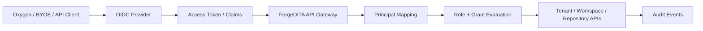

# Security Architecture

> **Document status:** Target security architecture. This document is not a certification or a claim that every described control is currently deployed. See [Product Status](../../STATUS.md).

ForgeDITA security should be explicit, tenant-aware, and boring in the best possible way. The product should not invent a login system, hide authorization rules in workflow behavior, or make tenant isolation depend on convention.

## Security Position

ForgeDITA owns authorization, resource scoping, auditability, and tenant isolation.

ForgeDITA should not own human password authentication. Human login should come from an external identity provider through OIDC/OAuth2.

Supported identity providers should eventually include enterprise providers such as Microsoft Entra ID, Okta, Auth0, Keycloak, or any standards-compliant OIDC provider.

## Target Model

Every request must resolve:

- `tenantId`
- `workspaceId` when applicable
- `repositoryId` when applicable
- `principalId`
- authentication method
- effective permissions

The identity provider proves who the actor is. ForgeDITA decides what the actor can do.

## Principals

Principals are tenant-owned actors.

Principal types:

- `user`: a human actor mapped from an external identity provider subject.
- `service`: a non-human actor used by automation, workers, integrations, or migration tooling.

Users should not be authenticated with ForgeDITA-managed passwords. Service accounts may use scoped client credentials, signed tokens, or generated API credentials depending on deployment needs.

## Roles And Permissions

Roles are named permission bundles. Grants attach roles to principals at a scope.

Grant scopes:

- `tenant`: applies across the tenant.
- `workspace`: applies to one workspace.
- `repository`: applies to one repository inside a workspace.

Baseline role taxonomy:

- `tenant-admin`: all permissions.
- `workspace-admin`: workspace authoring, workflow, validation, baseline, release, publish, policy/toolchain read.
- `repository-writer`: repository authoring, workflow, validation, baseline.
- `repository-reader`: read-only repository, node, baseline, and workflow visibility.
- `publisher`: release and publish-oriented role.

The production permission taxonomy should stay small, explicit, and API-oriented. Recommended permission groups:

- `tenant.admin`
- `policy.read`, `policy.write`
- `toolchain.read`, `toolchain.write`, `toolchain.promote`
- `repository.read`, `repository.write`
- `node.read`, `node.write`, `node.lock`
- `baseline.read`, `baseline.write`
- `release.read`, `release.write`
- `publish.submit`, `publish.read`, `publish.cancel`
- `workflow.read`, `workflow.write`
- `validation.use`
- `search.use`
- `audit.read`

Permission checks should remain independent from workflow state. Workflow can add gates, but it must not be the hidden source of authorization.

## Login Flow

Human login should use OIDC Authorization Code with PKCE.

For web clients:

1. User signs in through the configured identity provider.
2. Client receives an access token.
3. API validates issuer, audience, signature, expiry, and required claims.
4. API maps the external subject to a ForgeDITA principal.
5. API evaluates grants for the requested tenant/workspace/repository.

For Oxygen/BYOE clients:

1. Editor launches browser/device login.
2. User authenticates with the identity provider.
3. Editor receives or exchanges for a token using a safe desktop-app flow.
4. Editor calls ForgeDITA bootstrap.
5. Bootstrap returns only visible repositories, allowed actions, usable toolchains, publish profiles, and editor framework metadata.

## Service Accounts

Service accounts should be first-class principals, not fake users.

Expected uses:

- publish workers
- validation workers
- indexing workers
- migration/import tools
- CI conformance runners
- webhook relays

Service account tokens must be scoped, revocable, tenant-aware, and auditable.

Service-account credentials should support rotation metadata such as `keyId`, `status`, `notBefore`, and `expiresAt` so rotation can overlap safely without accepting retired tokens.

Every accepted service-account bearer-token request to tenant or workspace API paths should write an audit event with method, path, client id, key id, and credential expiry. The raw token must never be written to audit.

## Row-Level Security And Session Context

Application RBAC is the primary enforcement layer. PostgreSQL Row-Level Security should be defense in depth.

Each database session used for tenant data should carry explicit context:

- `ccms.tenant_id`
- `ccms.workspace_ids`
- `ccms.principal_id`
- `ccms.service_role` when a trusted worker path is being used

Workers must not read protected rows before scope is known. Queue payloads or a tightly audited bootstrap function must carry enough tenant/workspace/job scope to set context before protected reads.

## Secrets And Configuration

Secrets must not live in tracked config.

Production secrets include:

- database passwords
- OIDC client secrets if used
- service account credentials
- artifact signing secrets
- object-store credentials
- webhook signing secrets

Local development may use `.local` files, but production paths should resolve secrets from environment variables or deployment secret stores.

Startup should reject known development secrets unless the server is explicitly in local/development mode.

## Audit

Security-relevant actions should write audit events:

- login/session creation if visible to ForgeDITA
- token or service account use
- grant changes
- role changes
- policy changes
- checkout/check-in/cancel checkout
- workflow transition
- baseline/release creation
- publish/preview submission, cancellation, retry
- toolchain upload, validation, promotion, deprecation
- signed artifact URL generation
- import/export

Audit events should include tenant, workspace when applicable, repository/node when applicable, actor, action, timestamp, result, and request correlation id.

## Security Cut Line

ForgeDITA should have:

- no tracked local secrets
- production-safe config layering
- OIDC/OAuth2 token validation through JWKS-backed JWT signature checks
- principal mapping from token claims
- scoped service account model
- tenant/workspace/repository RBAC for all routes
- signed artifact links with non-development secrets
- RLS/session-context contract documented and tested for the worker path
- audit events for grants, policy, workflow, authoring, release, publish, and toolchain promotion

Full enterprise administration UI can come later, but the APIs and data model must not block it.

## Non-Goals

ForgeDITA should not:

- store human passwords
- implement its own MFA
- make workflow state the hidden permission system
- allow shared global publishing credentials across tenants
- rely on editor-side permissions for enforcement
- rely on object-store paths alone for access control

Security must reinforce the product promise: operational clarity, explicit behavior, reproducibility, and no hidden coupling.
